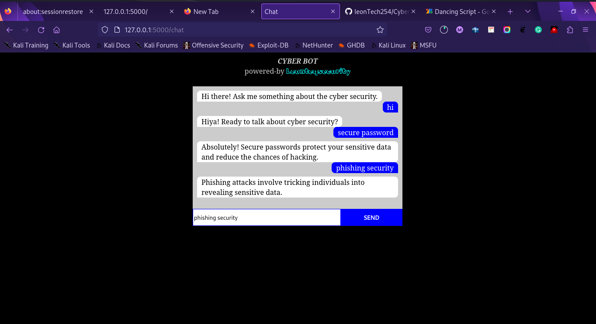

# CyberBot

 A simple chatbot for raising cybersecurity awareness, built using scikit-learn and Flask.


## Table of Contents

- [Introduction](#introduction)
- [Features](#features)
- [Demo](#demo)
- [Installation](#installation)
- [Usage](#usage)
- [Technologies](#technologies)
- [Contributing](#contributing)
- [License](#license)
- [Contact](#contact)

---

## Introduction

The Cybersecurity Awareness Chatbot is designed to educate and create awareness about cybersecurity best practices and common threats. This project utilizes scikit-learn to create a basic chatbot model and Flask for serving the chatbot through a web interface.

---

## Features

- Interactive chat-based learning about cybersecurity.
- Information on common cybersecurity threats and how to stay safe.
- User-friendly web interface powered by Flask.
- Basic machine learning using scikit-learn for natural language processing.

---

## Demo

- Include screenshots
---

## Installation

1. Clone this repository:

```bash
git clone git@github.com:leonTech254/CyberBot.git
```

2. navigate to the repository
```bash
cd CyberBot
```

3.install requirements
```bash
pip install sklearn flask

```
4. run the project
```bash
python3 app.py

```

## Technologies
- Python
- Flask
- scikit-learn
- HTML/CSS (for the web interface)


## Contributing

Contributions are welcome! Here's how you can get involved:

- Fork the repository.
- Create a new branch for your feature or bug fix.
- Make your changes and commit them.
- Push your changes to your fork.
- Submit a pull request.


## Contact

If you have any questions, feel free to reach out:

    Author:Leon Martin
    Project Link: https://github.com/leonTech254/CyberBot